# ログイン画面

## 項目

|項目名|属性|
|---|---|
|ID||
|パスワード||

## アクション

### 初期表示

- なにもしない

### ログイン

- タイミング
  - ログインボタン押下時

#### 成功

- トップ画面に遷移する

#### 失敗

- 以下の場合はエラー
  - IDがメールアドレスの形式でない
  - パスワードに規定文字がない
- エラー時はボタン上に「ログインに失敗しました」を表示する
