# トップ画面

## 仕様

- 商品を検索して一覧表示できる
  - 条件に合致する一覧のみに絞り込みできる
  - 一覧の並び順を変えることができる
  - 検索条件のクリアができる
    - 検索条件をクリアしても表示中の一覧はクリアしない

### 一覧の項目

|項目名|説明|
|---|---|
|商品名|1 ~ 50文字|
|価格|1 ~ 10,000の数字|
|在庫状況|補足参照|

補足

- 在庫状況は以下のいずれかを表示する
  - 在庫あり
  - 在庫なし
  - 入荷まち
